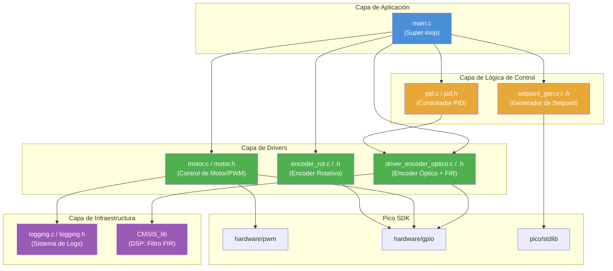
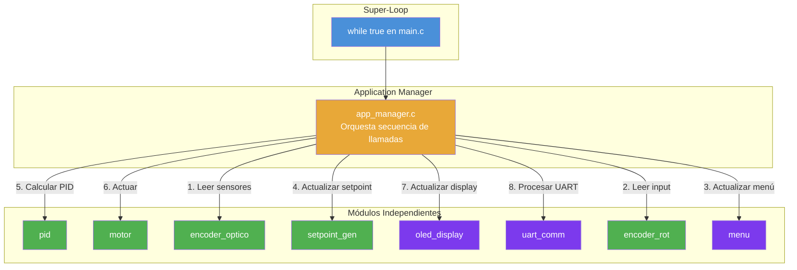
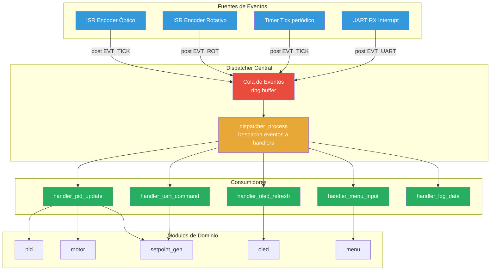
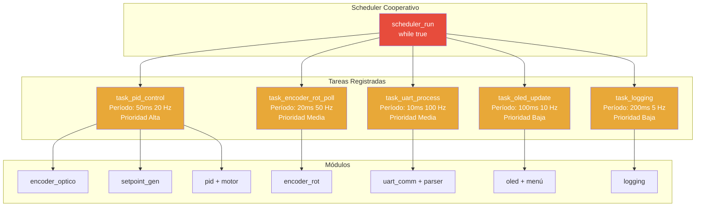
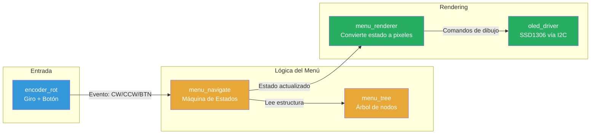
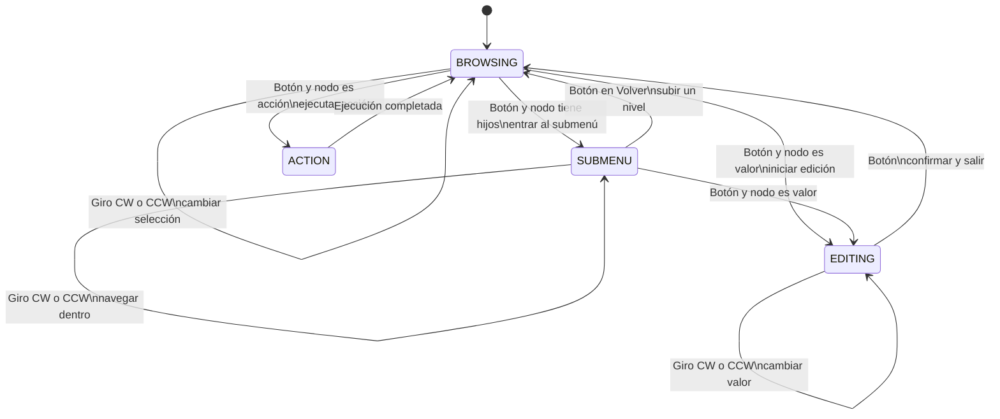
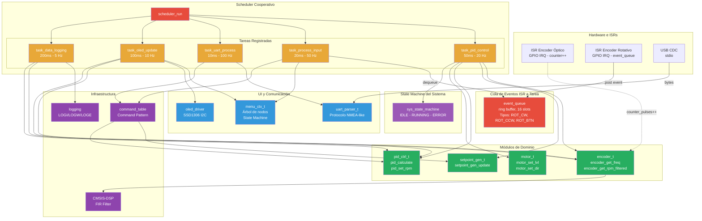

# Análisis Arquitectónico del Proyecto `pid_baremetal`

> [!NOTE]
> Este documento analiza la arquitectura actual del proyecto, presenta patrones de diseño aplicables a sistemas embedded baremetal en C, propone tres arquitecturas alternativas, y ofrece una recomendación final justificada para la evolución del proyecto.

---

## 1. Análisis del Estado Actual

### 1.1 Resumen de la Arquitectura

El proyecto `pid_baremetal` implementa un controlador PID discreto para motor DC sobre un Raspberry Pi Pico 2 (RP2040/RP2350, ARM Cortex-M0+), utilizando el Pico SDK v2.2.0 sin RTOS.

**Módulos actuales:**

| Módulo | Archivos | Responsabilidad |
|--------|----------|-----------------|
| **Motor/PWM** | `motor.h`, `motor.c` | Control de motor DC vía PWM: configuración de pines, duty cycle, dirección, validación de parámetros |
| **PID** | `pid.h`, `pid.c` | Controlador PID discreto con deadband, anti-windup por saturación, clamping |
| **Encoder Óptico** | `driver_encoder_optico.h`, `driver_encoder_optico.c` | Lectura de encoder de ranura, cálculo de frecuencia/RPM, filtrado FIR (CMSIS-DSP) |
| **Encoder Rotativo** | `encoder_rot.h`, `encoder_rot.c` | Lectura de encoder rotativo KY-040 para entrada de usuario, debounce por ISR |
| **Setpoint Generator** | `setpoint_gen.h`, `setpoint_gen.c` | Generación de referencia con modos step/ramp, transiciones suaves |
| **Logging** | `logging.h`, `logging.c` | Sistema de logs con niveles (INFO/WARN/ERROR/DEBUG), colores ANSI, macros de verificación |
| **Main** | `main.c` | Super-loop principal, instanciación de módulos, configuración de hardware |

### 1.2 Patrón Pseudo-OOP Existente

El proyecto adopta un estilo **orientación a objetos en C** consistente:

```c
// Estructura de configuración (inmutable tras init)
typedef struct {
    uint8_t pin_pwm;
    uint8_t pin_a;
    uint8_t pin_b;
    uint32_t frequency_hz;
} motor_config_t;

// Estructura de estado/contexto (mutable)
typedef struct {
    dir_t dir;
    float duty_cycle;
    motor_config_t motor_config;
    pwm_internal_config_t pwm_internal_config;
} motor_t;

// "Métodos" que operan sobre el contexto
motor_error_t motor_set_lvl(motor_t *m, float duty_cycle);
motor_error_t motor_set_dir(motor_t *m, dir_t dir);
```

### 1.3 Estructura del Super-Loop Actual

```c
void main() {
    // Inicialización
    motor_config(&motor_a, &motor_conf);
    encoder_init(&enc, &enc_config, fir_state, (void *)isr_encoder);
    setpoint_gen_init(&sp_gen, &sp_config);

    while (true) {
        encoder_get_freq(&enc);              // 1. Leer sensor
        encoder_get_rpm_filtered(&enc);
        setpoint_gen_update(&sp_gen);         // 2. Actualizar referencia
        pid_set_rpm(enc.rpm_filtered,         // 3. Calcular PID
                    sp_gen.current_value, &pid);
        motor_set_lvl(&motor_a, pid.last_output); // 4. Actuar
        printf("...");                        // 5. Log
        sleep_ms(SAMPLE_RATE_MS);             // 6. Esperar
    }
}
```

### 1.4 Mapa de Dependencias Actual



### 1.5 Uso de Timers e Interrupciones

| Recurso | Módulo | Uso |
|---------|--------|-----|
| GPIO IRQ (flanco) | `driver_encoder_optico` | Contador de pulsos del encoder óptico |
| GPIO IRQ (flanco) | `encoder_rot` | Detección de giro y dirección del encoder rotativo |
| `time_us_32()` | `driver_encoder_optico` | Cálculo de frecuencia (delta de tiempo) |
| `get_absolute_time()` | `setpoint_gen` | Cálculo de dt real para rampa |
| `sleep_ms()` | `main` | Período del loop de control (~50ms) |

> [!WARNING]
> El uso de `sleep_ms()` para temporización del loop bloquea completamente el procesador. No permite ejecutar otras tareas (UI, comunicación) durante la espera.

### 1.6 Limitaciones para Escalar

| Limitación | Impacto | Detalle |
|------------|---------|---------|
| **Super-loop bloqueante** | 🔴 Alto | `sleep_ms(50)` bloquea todo: no se pueden atender UART, menú OLED, ni encoder rotativo durante ese tiempo |
| **Acoplamiento directo en `main.c`** | 🟡 Medio | `main.c` conoce y orquesta todos los módulos directamente; agregar uno nuevo requiere modificar el loop |
| **Sin abstracción de comunicación** | 🔴 Alto | No existe infraestructura para comunicación UART estructurada (solo `printf` para debug) |
| **Sin sistema de UI** | 🔴 Alto | No hay framework para menú OLED, navegación, ni renderizado |
| **`pid.c` depende de `driver_encoder_optico.h`** | 🟡 Medio | El PID incluye el header del encoder aunque no usa sus tipos directamente — acoplamiento innecesario |
| **ISR del encoder rotativo sin uso** | 🟢 Bajo | El encoder rotativo está configurado pero no integrado al loop de control |
| **Variables globales en `encoder_rot.c`** | 🟡 Medio | `instancia_encoder` y `last_interrupt_time` como globales estáticas dificultan múltiples instancias |

---

## 2. Patrones de Diseño Aplicables a Embedded C Baremetal

### 2.1 Command Pattern (Patrón Comando)

**¿Qué es?** Encapsula una operación como un "objeto" (en C: struct + puntero a función), permitiendo parametrizar, encolar y ejecutar acciones de forma desacoplada.

**¿Cómo aplica a este proyecto?** Para procesar comandos del menú OLED y del protocolo UART de forma unificada. Una misma acción ("cambiar setpoint a 500 RPM") puede dispararse desde el encoder rotativo O desde un comando UART.

**Pros:**
- Desacopla la fuente del comando (UART, menú, botón) de la acción
- Facilita agregar nuevos comandos sin modificar el dispatcher
- Permite undo/redo si se necesita

**Contras:**
- Overhead de punteros a función (mínimo en ARM)
- Más complejidad estructural que llamadas directas

```c
/* ── command.h ── */
#ifndef COMMAND_H
#define COMMAND_H

#ifdef __cplusplus
extern "C" {
#endif

#include <stdint.h>

/**
 * @brief Tipo de función que ejecuta un comando.
 * @param arg Argumento genérico (puede ser un float*, struct*, etc.)
 */
typedef void (*command_fn_t)(void *arg);

/**
 * @brief Descriptor de un comando registrado.
 */
typedef struct {
    /** @brief Identificador único del comando */
    uint8_t id;
    /** @brief Nombre legible para debug/log */
    const char *name;
    /** @brief Función que ejecuta el comando */
    command_fn_t execute;
} command_t;

/**
 * @brief Busca y ejecuta un comando por su ID.
 * @param id  Identificador del comando
 * @param arg Argumento a pasar a la función
 */
void command_dispatch(uint8_t id, void *arg);

/**
 * @brief Registra la tabla de comandos disponibles.
 * @param table  Array de command_t
 * @param count  Número de comandos en la tabla
 */
void command_init(const command_t *table, uint8_t count);

#ifdef __cplusplus
}
#endif

#endif // COMMAND_H
```

```c
/* ── Ejemplo de uso ── */

// Handlers de comandos
static void cmd_set_target(void *arg) {
    float *value = (float *)arg;
    setpoint_gen_set_target(&sp_gen, *value);
    pid_reset(&pid);
}

static void cmd_set_mode(void *arg) {
    setpoint_mode_t *mode = (setpoint_mode_t *)arg;
    setpoint_gen_set_mode(&sp_gen, *mode);
}

// Tabla de comandos
static const command_t cmd_table[] = {
    { .id = 0x01, .name = "SET_TARGET", .execute = cmd_set_target },
    { .id = 0x02, .name = "SET_MODE",   .execute = cmd_set_mode },
};

// Inicialización
command_init(cmd_table, 2);

// Desde UART o menú:
float new_target = 800.0f;
command_dispatch(0x01, &new_target);
```

---

### 2.2 State Machine (Máquina de Estados)

**¿Qué es?** Modela el comportamiento de un sistema como un conjunto finito de estados con transiciones definidas. Cada estado tiene un comportamiento de entrada, ejecución y salida.

**¿Cómo aplica?** Para gestionar los estados del sistema (IDLE, RUNNING, ERROR, CALIBRATING) y para la navegación del menú OLED.

**Pros:**
- Comportamiento predecible y fácil de depurar
- Evita flags booleanas anidadas ("spaghetti de ifs")
- Documentable con diagramas de estado

**Contras:**
- Puede crecer en complejidad si hay muchos estados
- Requiere disciplina para definir todas las transiciones

```c
/* ── state_machine.h ── */
#ifndef STATE_MACHINE_H
#define STATE_MACHINE_H

#ifdef __cplusplus
extern "C" {
#endif

#include <stdint.h>

/**
 * @brief Tipo de función para acciones de estado.
 * @param ctx Contexto de la máquina de estados
 */
typedef void (*state_action_t)(void *ctx);

/**
 * @brief Descriptor de un estado.
 */
typedef struct {
    /** @brief Nombre del estado (para debug) */
    const char *name;
    /** @brief Acción ejecutada al entrar al estado */
    state_action_t on_enter;
    /** @brief Acción ejecutada en cada tick del estado */
    state_action_t on_run;
    /** @brief Acción ejecutada al salir del estado */
    state_action_t on_exit;
} state_t;

/**
 * @brief Contexto de la máquina de estados.
 */
typedef struct {
    /** @brief Array de estados disponibles */
    const state_t *states;
    /** @brief Número total de estados */
    uint8_t state_count;
    /** @brief Índice del estado actual */
    uint8_t current;
    /** @brief Contexto de usuario (puntero genérico) */
    void *user_ctx;
} state_machine_t;

void sm_init(state_machine_t *sm, const state_t *states,
             uint8_t count, uint8_t initial, void *ctx);
void sm_transition(state_machine_t *sm, uint8_t new_state);
void sm_run(state_machine_t *sm);

#ifdef __cplusplus
}
#endif

#endif // STATE_MACHINE_H
```

```c
/* ── Ejemplo: Estados del sistema ── */
typedef enum {
    SYS_STATE_IDLE,
    SYS_STATE_RUNNING,
    SYS_STATE_ERROR,
    SYS_STATE_COUNT
} sys_state_id_t;

static void state_idle_enter(void *ctx) {
    motor_set_lvl(&motor_a, 0);
    LOGI("SYS", "Motor detenido - modo IDLE");
}

static void state_running_run(void *ctx) {
    encoder_get_freq(&enc);
    encoder_get_rpm_filtered(&enc);
    setpoint_gen_update(&sp_gen);
    pid_set_rpm(enc.rpm_filtered, sp_gen.current_value, &pid);
    motor_set_lvl(&motor_a, pid.last_output);
}

static void state_error_enter(void *ctx) {
    motor_set_lvl(&motor_a, 0);
    LOGE("SYS", "Estado de error - motor detenido por seguridad");
}

static const state_t sys_states[] = {
    [SYS_STATE_IDLE]    = { "IDLE",    state_idle_enter, NULL, NULL },
    [SYS_STATE_RUNNING] = { "RUNNING", NULL, state_running_run, NULL },
    [SYS_STATE_ERROR]   = { "ERROR",   state_error_enter, NULL, NULL },
};
```

---

### 2.3 Observer / Publish-Subscribe

**¿Qué es?** Permite que un módulo (publisher) notifique a otros módulos (subscribers) cuando ocurre un evento, sin que el publisher conozca a los subscribers.

**¿Cómo aplica?** Cuando el encoder rotativo cambia de valor, notificar simultáneamente al menú OLED (actualizar display) y al setpoint generator (cambiar target). Cuando el PID cambia de estado, notificar al logger UART.

**Pros:**
- Desacoplamiento total entre módulos
- Agregar un nuevo subscriber no modifica al publisher
- Ideal para sistemas reactivos

**Contras:**
- Orden de notificación no determinista (puede serlo si se implementa con prioridad)
- Overhead de indirección por punteros a función
- Debugging más difícil (el flujo no es lineal)

```c
/* ── event.h ── */
#ifndef EVENT_H
#define EVENT_H

#ifdef __cplusplus
extern "C" {
#endif

#include <stdint.h>
#include <stdbool.h>

/** @brief Número máximo de tipos de evento */
#define EVENT_MAX_TYPES     8
/** @brief Número máximo de subscribers por evento */
#define EVENT_MAX_SUBS      4

/**
 * @brief Tipos de evento del sistema.
 */
typedef enum {
    EVENT_ENCODER_CHANGED,
    EVENT_SETPOINT_ARRIVED,
    EVENT_PID_ERROR_HIGH,
    EVENT_SYSTEM_ERROR,
    EVENT_UART_CMD_RECEIVED,
    EVENT_COUNT
} event_type_t;

/**
 * @brief Datos genéricos del evento.
 */
typedef struct {
    event_type_t type;
    union {
        float  f_value;
        int    i_value;
        void  *ptr;
    } data;
} event_t;

/** @brief Tipo de callback para subscribers */
typedef void (*event_handler_t)(const event_t *event);

bool event_subscribe(event_type_t type, event_handler_t handler);
void event_publish(const event_t *event);
void event_init(void);

#ifdef __cplusplus
}
#endif

#endif // EVENT_H
```

```c
/* ── Ejemplo de uso ── */

// El menú OLED se suscribe a cambios del encoder
static void menu_on_encoder_change(const event_t *event) {
    int delta = event->data.i_value;
    menu_navigate(delta);
    oled_refresh();
}
event_subscribe(EVENT_ENCODER_CHANGED, menu_on_encoder_change);

// El setpoint se suscribe al mismo evento cuando está en modo "ajuste"
static void sp_on_encoder_change(const event_t *event) {
    float delta = (float)event->data.i_value * 10.0f;
    float new_target = sp_gen.config.target_value + delta;
    setpoint_gen_set_target(&sp_gen, new_target);
}
event_subscribe(EVENT_ENCODER_CHANGED, sp_on_encoder_change);

// En la ISR del encoder rotativo:
event_t evt = {
    .type = EVENT_ENCODER_CHANGED,
    .data.i_value = (direction == ENC_CLOCKWISE) ? 1 : -1,
};
event_publish(&evt);  // Nota: en ISR, encolar; en main, despachar
```

---

### 2.4 Mediator / Event Dispatcher Central

**¿Qué es?** Un módulo central (mediador) recibe todos los eventos y los enruta a los módulos correspondientes. Es similar a pub/sub pero con un punto de control centralizado.

**¿Cómo aplica?** El dispatcher central recibe eventos de ISRs (via cola), del timer del loop, y del parser UART, y los despacha a los handlers apropiados.

**Pros:**
- Un solo punto de control del flujo de eventos
- Facilita debugging (se puede loguear todo en un punto)
- Permite priorización de eventos

**Contras:**
- El mediador puede volverse un "God Object" si no se diseña bien
- Single point of failure

```c
/* ── dispatcher.h ── */
#ifndef DISPATCHER_H
#define DISPATCHER_H

#ifdef __cplusplus
extern "C" {
#endif

#include <stdint.h>
#include <stdbool.h>

/** @brief Capacidad de la cola de eventos */
#define DISPATCHER_QUEUE_SIZE   16

typedef enum {
    DISP_EVT_NONE = 0,
    DISP_EVT_TICK,            // Timer del loop principal
    DISP_EVT_ENCODER_OPTICO,  // Nueva lectura de encoder óptico
    DISP_EVT_ENCODER_ROT,     // Giro del encoder rotativo
    DISP_EVT_ENCODER_BTN,     // Botón del encoder rotativo
    DISP_EVT_UART_RX,         // Comando UART recibido
    DISP_EVT_PID_UPDATE,      // PID calculó nueva salida
    DISP_EVT_COUNT
} disp_event_id_t;

typedef struct {
    disp_event_id_t id;
    uint32_t timestamp_us;
    union {
        float f_value;
        int32_t i_value;
        uint8_t bytes[4];
    } payload;
} disp_event_t;

typedef void (*disp_handler_t)(const disp_event_t *event);

void dispatcher_init(void);
bool dispatcher_register(disp_event_id_t id, disp_handler_t handler);
bool dispatcher_post(const disp_event_t *event);
void dispatcher_process(void);  // Llamar en el super-loop

#ifdef __cplusplus
}
#endif

#endif // DISPATCHER_H
```

---

### 2.5 Protocol Parser (Parser de Protocolo UART)

**¿Qué es?** Una máquina de estados que parsea bytes entrantes de un stream serie, detectando tramas completas y extrayendo el payload.

**¿Cómo aplica?** Para implementar comunicación bidireccional con una aplicación de PC vía UART/USB CDC.

**Pros:**
- Procesamiento byte a byte (no necesita buffer completo)
- Detección de errores (checksum, timeout)
- Reutilizable para diferentes protocolos

**Contras:**
- Complejidad del parser (múltiples estados)
- Necesita manejo de timeouts para tramas incompletas

```c
/* ── proto_parser.h ── */
#ifndef PROTO_PARSER_H
#define PROTO_PARSER_H

#ifdef __cplusplus
extern "C" {
#endif

#include <stdint.h>
#include <stdbool.h>

/** @brief Tamaño máximo del payload */
#define PROTO_MAX_PAYLOAD   32

/**
 * @brief Estados del parser.
 */
typedef enum {
    PROTO_STATE_WAIT_HEADER,
    PROTO_STATE_READ_CMD,
    PROTO_STATE_READ_LEN,
    PROTO_STATE_READ_PAYLOAD,
    PROTO_STATE_READ_CHECKSUM,
} proto_state_t;

/**
 * @brief Trama parseada.
 */
typedef struct {
    uint8_t cmd;
    uint8_t length;
    uint8_t payload[PROTO_MAX_PAYLOAD];
    uint8_t checksum;
} proto_frame_t;

/**
 * @brief Callback invocado al recibir una trama válida.
 */
typedef void (*proto_callback_t)(const proto_frame_t *frame);

/**
 * @brief Contexto del parser.
 */
typedef struct {
    proto_state_t state;
    proto_frame_t frame;
    uint8_t payload_idx;
    proto_callback_t on_frame;
} proto_parser_t;

void proto_parser_init(proto_parser_t *parser, proto_callback_t callback);
void proto_parser_feed(proto_parser_t *parser, uint8_t byte);

#ifdef __cplusplus
}
#endif

#endif // PROTO_PARSER_H
```

```c
/* ── Ejemplo conceptual de implementación ── */
void proto_parser_feed(proto_parser_t *parser, uint8_t byte) {
    switch (parser->state) {
        case PROTO_STATE_WAIT_HEADER:
            if (byte == 0xAA) {
                parser->state = PROTO_STATE_READ_CMD;
            }
            break;

        case PROTO_STATE_READ_CMD:
            parser->frame.cmd = byte;
            parser->state = PROTO_STATE_READ_LEN;
            break;

        case PROTO_STATE_READ_LEN:
            parser->frame.length = byte;
            parser->payload_idx = 0;
            if (byte == 0) {
                parser->state = PROTO_STATE_READ_CHECKSUM;
            } else {
                parser->state = PROTO_STATE_READ_PAYLOAD;
            }
            break;

        case PROTO_STATE_READ_PAYLOAD:
            parser->frame.payload[parser->payload_idx++] = byte;
            if (parser->payload_idx >= parser->frame.length) {
                parser->state = PROTO_STATE_READ_CHECKSUM;
            }
            break;

        case PROTO_STATE_READ_CHECKSUM:
            parser->frame.checksum = byte;
            // Verificar checksum y despachar
            if (parser->on_frame) {
                parser->on_frame(&parser->frame);
            }
            parser->state = PROTO_STATE_WAIT_HEADER;
            break;
    }
}
```

---

### 2.6 Cooperative Scheduler (Scheduler Cooperativo)

**¿Qué es?** Un planificador simple que ejecuta tareas registradas a intervalos definidos, sin preemption. Cada tarea se ejecuta hasta que retorna voluntariamente.

**¿Cómo aplica?** Reemplaza el `sleep_ms()` bloqueante del super-loop actual, permitiendo ejecutar tareas a diferentes frecuencias (PID a 20Hz, OLED a 10Hz, UART polling a 100Hz).

**Pros:**
- Sin problemas de concurrencia (no hay preemption)
- Cada tarea tiene su propio período
- Mucho más simple que un RTOS
- Determinista y predecible

**Contras:**
- Si una tarea tarda mucho, bloquea a las demás
- No hay prioridades reales
- El desarrollador debe garantizar que las tareas sean "cortas"

```c
/* ── scheduler.h ── */
#ifndef SCHEDULER_H
#define SCHEDULER_H

#ifdef __cplusplus
extern "C" {
#endif

#include <stdint.h>
#include <stdbool.h>

/** @brief Número máximo de tareas registrables */
#define SCHED_MAX_TASKS     8

/**
 * @brief Tipo de función de tarea.
 */
typedef void (*task_fn_t)(void);

/**
 * @brief Descriptor de una tarea del scheduler.
 */
typedef struct {
    /** @brief Nombre de la tarea (para debug) */
    const char *name;
    /** @brief Función a ejecutar */
    task_fn_t run;
    /** @brief Período en milisegundos */
    uint32_t period_ms;
    /** @brief Timestamp de la última ejecución */
    uint32_t last_run_ms;
    /** @brief Flag: la tarea está habilitada */
    bool enabled;
} sched_task_t;

void scheduler_init(void);
bool scheduler_add_task(const char *name, task_fn_t fn,
                        uint32_t period_ms);
void scheduler_run(void);  // Llamar en while(true)

#ifdef __cplusplus
}
#endif

#endif // SCHEDULER_H
```

```c
/* ── Ejemplo de uso ── */
void task_pid_control(void) {
    encoder_get_freq(&enc);
    encoder_get_rpm_filtered(&enc);
    setpoint_gen_update(&sp_gen);
    pid_set_rpm(enc.rpm_filtered, sp_gen.current_value, &pid);
    motor_set_lvl(&motor_a, pid.last_output);
}

void task_oled_refresh(void) {
    oled_draw_rpm(enc.rpm_filtered);
    oled_draw_setpoint(sp_gen.current_value);
    oled_update();
}

void task_uart_poll(void) {
    while (uart_is_readable(uart0)) {
        uint8_t byte = uart_getc(uart0);
        proto_parser_feed(&parser, byte);
    }
}

void main() {
    // ... inicialización ...
    scheduler_init();
    scheduler_add_task("PID",  task_pid_control, 50);   // 20 Hz
    scheduler_add_task("OLED", task_oled_refresh, 100);  // 10 Hz
    scheduler_add_task("UART", task_uart_poll, 10);      // 100 Hz

    while (true) {
        scheduler_run();
    }
}
```

---

## 3. Arquitecturas Propuestas

### 3.1 Opción A: Super-Loop con Módulos Independientes Mejorado

Evolución del enfoque actual: mantener el super-loop pero con módulos mejor desacoplados y un "application manager" que orqueste la lógica.



| Aspecto | Evaluación |
|---------|------------|
| **Complejidad de implementación** | 🟢 Baja — evolución natural del código actual |
| **Desacoplamiento** | 🟡 Medio — el app_manager sigue orquestando todo secuencialmente |
| **Temporización** | 🔴 Problemática — todas las tareas corren a la misma frecuencia |
| **Escalabilidad** | 🟡 Media — agregar un módulo implica agregar una línea en el loop |
| **Debugging** | 🟢 Fácil — flujo lineal, predecible |
| **Cuándo elegir** | Cuando el proyecto permanece simple y no se necesitan tareas a diferentes frecuencias |

---

### 3.2 Opción B: Arquitectura Event-Driven con Dispatcher Central

Los módulos producen y consumen eventos a través de un dispatcher central. La ISR encola eventos; el loop principal los despacha.



| Aspecto | Evaluación |
|---------|------------|
| **Complejidad de implementación** | 🟡 Media — requiere cola de eventos y dispatcher |
| **Desacoplamiento** | 🟢 Alto — los módulos solo conocen los tipos de evento, no a los otros módulos |
| **Temporización** | 🟡 Media — depende de la frecuencia del tick y la longitud de la cola |
| **Escalabilidad** | 🟢 Alta — agregar un módulo = agregar un handler + suscripción |
| **Debugging** | 🟡 Medio — el flujo no es lineal; se puede loguear la cola |
| **Cuándo elegir** | Cuando el sistema es reactivo (responde a eventos externos) y hay múltiples fuentes de entrada |

---

### 3.3 Opción C: Scheduler Cooperativo con Tareas a Diferentes Frecuencias

Un scheduler simple ejecuta tareas registradas según su período individual. Combina la simplicidad del super-loop con la flexibilidad de frecuencias múltiples.



| Aspecto | Evaluación |
|---------|------------|
| **Complejidad de implementación** | 🟢 Baja — el scheduler son ~50 líneas de código |
| **Desacoplamiento** | 🟢 Alto — cada tarea es independiente |
| **Temporización** | 🟢 Buena — cada tarea tiene su propio período |
| **Escalabilidad** | 🟢 Alta — agregar tarea = una línea `scheduler_add_task()` |
| **Debugging** | 🟢 Fácil — se puede medir el jitter de cada tarea |
| **Cuándo elegir** | Cuando se necesitan tareas a diferentes frecuencias sin la complejidad de eventos |

### 3.4 Comparativa de Arquitecturas

| Criterio | A: Super-Loop Mejorado | B: Event-Driven | C: Scheduler Cooperativo |
|----------|:---------------------:|:----------------:|:------------------------:|
| Complejidad de implementación | ⭐⭐⭐ | ⭐⭐ | ⭐⭐⭐ |
| Desacoplamiento entre módulos | ⭐ | ⭐⭐⭐ | ⭐⭐ |
| Soporte multi-frecuencia | ❌ | ⭐⭐ | ⭐⭐⭐ |
| Latencia de respuesta a eventos | ⭐ | ⭐⭐⭐ | ⭐⭐ |
| Facilidad de debugging | ⭐⭐⭐ | ⭐ | ⭐⭐⭐ |
| Escalabilidad para nuevos módulos | ⭐ | ⭐⭐⭐ | ⭐⭐⭐ |
| Curva de aprendizaje | ⭐⭐⭐ | ⭐⭐ | ⭐⭐⭐ |
| Adecuado para OLED + UART | ⭐ | ⭐⭐⭐ | ⭐⭐⭐ |

---

## 4. Protocolo UART Propuesto

### 4.1 Opciones de Protocolo

#### Opción 1: Texto Plano (ASCII)

```
SET TARGET 500\r\n
GET RPM\r\n
SET KP 0.025\r\n
```

#### Opción 2: Binario con Encabezado Fijo

```
[HEADER: 0xAA] [CMD: 1B] [LEN: 1B] [PAYLOAD: 0-32B] [CHECKSUM: 1B]
```

#### Opción 3: Protocolo Híbrido (Texto Estructurado)

```
$CMD,ARG1,ARG2*CS\r\n

Ejemplos:
$SET,TARGET,500.0*A3\r\n
$GET,RPM*B1\r\n
$SET,KP,0.025*7F\r\n
$RSP,RPM,487.32*C4\r\n
```

### 4.2 Comparativa de Protocolos

| Criterio | Texto Plano | Binario | Híbrido (Recomendado) |
|----------|:-----------:|:-------:|:---------------------:|
| Legibilidad humana | ⭐⭐⭐ | ❌ | ⭐⭐⭐ |
| Eficiencia de ancho de banda | ⭐ | ⭐⭐⭐ | ⭐⭐ |
| Facilidad de parseo en Pico | ⭐⭐ | ⭐⭐⭐ | ⭐⭐ |
| Facilidad de parseo en PC | ⭐⭐⭐ | ⭐⭐ | ⭐⭐⭐ |
| Detección de errores | ❌ | ⭐⭐⭐ | ⭐⭐ |
| Debuggeabilidad con terminal | ⭐⭐⭐ | ❌ | ⭐⭐⭐ |
| Framing claro | ❌ | ⭐⭐⭐ | ⭐⭐⭐ |
| Complejidad de implementación | ⭐⭐⭐ | ⭐ | ⭐⭐ |

### 4.3 Recomendación: Protocolo Híbrido Tipo NMEA

> [!TIP]
> Se recomienda el **protocolo híbrido** estilo NMEA/GPS porque combina legibilidad humana (se puede debuggear con cualquier terminal serie), framing claro (`$` inicio, `*CS\r\n` fin), y detección de errores básica (checksum XOR).

**Formato propuesto:**

```
Trama: $CMD,PARAM1,PARAM2,...*CS\r\n

Donde:
  $     = Inicio de trama
  CMD   = Comando (3-4 caracteres ASCII)
  ,     = Separador de campos
  *     = Separador antes del checksum
  CS    = Checksum XOR de todos los bytes entre $ y * (2 hex chars)
  \r\n  = Fin de trama
```

**Tabla de comandos propuesta:**

| Comando | Dirección | Formato | Descripción |
|---------|-----------|---------|-------------|
| `$STGT,500.0*CS` | PC → Pico | Set Target | Establecer setpoint (RPM) |
| `$SMOD,RAMP*CS` | PC → Pico | Set Mode | Cambiar modo (STEP/RAMP) |
| `$SRAT,100.0*CS` | PC → Pico | Set Rate | Velocidad de rampa (RPM/s) |
| `$SKP,0.025*CS` | PC → Pico | Set Kp | Ganancia proporcional |
| `$SKI,0.005*CS` | PC → Pico | Set Ki | Ganancia integral |
| `$SKD,0.001*CS` | PC → Pico | Set Kd | Ganancia derivativa |
| `$PRST*CS` | PC → Pico | PID Reset | Reiniciar estado del PID |
| `$GALL*CS` | PC → Pico | Get All | Solicitar todos los datos |
| `$RDAT,487.3,500.0,12.7,45.2*CS` | Pico → PC | Report Data | RPM, setpoint, error, output |
| `$RSTA,RUNNING*CS` | Pico → PC | Report Status | Estado del sistema |
| `$RERR,msg*CS` | Pico → PC | Report Error | Error del sistema |
| `$RACK,CMD*CS` | Pico → PC | Acknowledge | Confirmación de comando |

**Implementación del parser (estilo del proyecto):**

```c
/* ── uart_proto.h ── */
#ifndef UART_PROTO_H
#define UART_PROTO_H

#ifdef __cplusplus
extern "C" {
#endif

#include <stdint.h>
#include <stdbool.h>

#define UART_PROTO_MAX_FIELDS   8
#define UART_PROTO_MAX_FIELD_LEN 16
#define UART_PROTO_MAX_LINE     128

typedef struct {
    char cmd[5];
    char fields[UART_PROTO_MAX_FIELDS][UART_PROTO_MAX_FIELD_LEN];
    uint8_t field_count;
    uint8_t checksum;
    bool valid;
} uart_frame_t;

typedef struct {
    char buffer[UART_PROTO_MAX_LINE];
    uint8_t idx;
    bool receiving;
} uart_parser_t;

void uart_parser_init(uart_parser_t *parser);
bool uart_parser_feed(uart_parser_t *parser, uint8_t byte,
                      uart_frame_t *frame_out);
uint8_t uart_calc_checksum(const char *data, uint8_t len);

#ifdef __cplusplus
}
#endif

#endif // UART_PROTO_H
```

---

## 5. Arquitectura del Menú OLED

### 5.1 Enfoque: Árbol de Nodos con State Machine

El menú se modela como un **árbol de nodos** donde cada nodo puede ser:
- **Nodo contenedor**: tiene hijos (submenú)
- **Nodo acción**: ejecuta una función al seleccionarse
- **Nodo valor**: permite editar un parámetro numérico

La **navegación** se implementa como una máquina de estados:
- **BROWSING**: el usuario navega entre items del menú
- **EDITING**: el usuario está editando un valor numérico
- **CONFIRMING**: el usuario confirma una acción

### 5.2 Separación Lógica vs Renderizado

> [!IMPORTANT]
> La arquitectura del menú debe separar estrictamente la **lógica de navegación** (qué item está seleccionado, qué valor se edita) del **renderizado** (cómo se dibujan los píxeles en el OLED). Esto permite cambiar de display (SSD1306 → SH1106) sin tocar la lógica del menú.



### 5.3 Diagrama de la Máquina de Estados del Menú



### 5.4 Estructuras del Menú

```c
/* ── menu.h ── */
#ifndef MENU_H
#define MENU_H

#ifdef __cplusplus
extern "C" {
#endif

#include <stdint.h>
#include <stdbool.h>

/** @brief Tipos de nodo del menú */
typedef enum {
    MENU_NODE_SUBMENU,   // Tiene hijos (es un contenedor)
    MENU_NODE_ACTION,    // Ejecuta una función
    MENU_NODE_VALUE,     // Edita un valor float
} menu_node_type_t;

/** @brief Estados de navegación */
typedef enum {
    MENU_STATE_BROWSING,
    MENU_STATE_EDITING,
} menu_state_t;

/** @brief Callback para nodos de acción */
typedef void (*menu_action_fn_t)(void);

/**
 * @brief Nodo del árbol de menú.
 */
typedef struct menu_node {
    /** @brief Texto a mostrar en el display */
    const char *label;
    /** @brief Tipo de nodo */
    menu_node_type_t type;

    union {
        /** @brief Para MENU_NODE_SUBMENU: array de hijos */
        struct {
            const struct menu_node *children;
            uint8_t child_count;
        } submenu;

        /** @brief Para MENU_NODE_ACTION: función a ejecutar */
        menu_action_fn_t action;

        /** @brief Para MENU_NODE_VALUE: puntero al valor editable */
        struct {
            float *value_ptr;
            float min;
            float max;
            float step;
            const char *unit;
        } value;
    };
} menu_node_t;

/**
 * @brief Contexto del menú.
 */
typedef struct {
    /** @brief Nodo raíz del árbol */
    const menu_node_t *root;
    /** @brief Nodo actual (navegación) */
    const menu_node_t *current_parent;
    /** @brief Índice del item seleccionado */
    uint8_t selected_idx;
    /** @brief Estado de la máquina */
    menu_state_t state;
    /** @brief Flag: el display necesita actualizarse */
    bool dirty;
} menu_ctx_t;

void menu_init(menu_ctx_t *ctx, const menu_node_t *root);
void menu_on_rotate(menu_ctx_t *ctx, int direction);
void menu_on_button(menu_ctx_t *ctx);
bool menu_needs_refresh(const menu_ctx_t *ctx);

#ifdef __cplusplus
}
#endif

#endif // MENU_H
```

```c
/* ── Ejemplo de definición del árbol ── */

// Sub-menú de ganancias PID
static const menu_node_t pid_items[] = {
    { .label = "Kp", .type = MENU_NODE_VALUE,
      .value = { &pid.kp, 0.0f, 10.0f, 0.001f, "" } },
    { .label = "Ki", .type = MENU_NODE_VALUE,
      .value = { &pid.ki, 0.0f, 1.0f, 0.0001f, "" } },
    { .label = "Kd", .type = MENU_NODE_VALUE,
      .value = { &pid.kd, 0.0f, 1.0f, 0.0001f, "" } },
};

// Sub-menú de setpoint
static const menu_node_t sp_items[] = {
    { .label = "Target RPM", .type = MENU_NODE_VALUE,
      .value = { &sp_gen.config.target_value, 0.0f, 3000.0f, 10.0f, "RPM" } },
    { .label = "Rampa", .type = MENU_NODE_VALUE,
      .value = { &sp_gen.config.ramp_rate, 10.0f, 500.0f, 10.0f, "RPM/s" } },
};

// Menú raíz
static const menu_node_t root_items[] = {
    { .label = "PID", .type = MENU_NODE_SUBMENU,
      .submenu = { pid_items, 3 } },
    { .label = "Setpoint", .type = MENU_NODE_SUBMENU,
      .submenu = { sp_items, 2 } },
    { .label = "PID Reset", .type = MENU_NODE_ACTION,
      .action = cmd_pid_reset },
    { .label = "Motor STOP", .type = MENU_NODE_ACTION,
      .action = cmd_motor_stop },
};

static const menu_node_t menu_root = {
    .label = "Menu Principal",
    .type = MENU_NODE_SUBMENU,
    .submenu = { root_items, 4 },
};
```

---

## 6. Recomendación Final

### 6.1 Arquitectura Recomendada: Scheduler Cooperativo + Event Queue Ligera (Opción C + elementos de B)

> [!IMPORTANT]
> Se recomienda una **arquitectura híbrida** que combine el **scheduler cooperativo** (Opción C) como base de ejecución, con una **cola de eventos ligera** (inspirada en la Opción B) para comunicación entre ISRs y tareas.

**Justificación para ESTE proyecto específico:**

| Factor | Decisión | Razón |
|--------|----------|-------|
| **Tamaño del proyecto** | Scheduler cooperativo | Es suficiente para 5-8 tareas; un event-driven puro sería over-engineering |
| **Desarrollador único** | Simplicidad sobre elegancia | El scheduler cooperativo es trivial de debuggear y mantener |
| **Baremetal sin RTOS** | Sin preemption | El scheduler cooperativo respeta esta restricción naturalmente |
| **Pico SDK** | Compatible | `time_us_32()` / `get_absolute_time()` ya se usan; el scheduler solo necesita eso |
| **OLED + UART** | Multi-frecuencia | El PID necesita 20Hz, el OLED 10Hz, el UART 100Hz — el scheduler lo resuelve de forma limpia |
| **Encoder rotativo (ISR)** | Cola de eventos | Los eventos de ISR se encolan y se procesan en la tarea correspondiente |
| **Crecimiento futuro** | Escalable | Agregar una tarea = una línea; agregar un evento = un enum |

**Patrones a incorporar:**

1. **Scheduler cooperativo** → Estructura base del loop
2. **Cola de eventos (ring buffer)** → Comunicación ISR → tareas
3. **State machine** → Estados del sistema (IDLE/RUNNING/ERROR) y menú OLED
4. **Command pattern** → Unificar comandos UART y menú en una tabla
5. **Protocol parser** → Parseo de protocolo UART híbrido

### 6.2 ¿Qué NO implementar?

| Patrón/Técnica | Razón para descartarlo |
|----------------|----------------------|
| RTOS (FreeRTOS) | Overhead innecesario para este tamaño de proyecto; el scheduler cooperativo es suficiente |
| Observer/Pub-Sub completo | Over-engineering para un proyecto de un solo desarrollador con 5-8 módulos |
| Protocolo binario puro | Sacrifica la debuggeabilidad sin beneficio real (no hay restricción de ancho de banda) |
| DMA para UART | El volumen de datos es bajo; polling en tarea del scheduler es suficiente |

---

## 7. Diagrama de Arquitectura Completo (Recomendación Final)



### 7.1 Estructura de Archivos Propuesta

```
pid_baremetal/
├── main.c                          # Inicialización y scheduler_run()
├── CMakeLists.txt
│
├── core/                           # Infraestructura reutilizable
│   ├── scheduler.h / .c           # Scheduler cooperativo
│   ├── event_queue.h / .c         # Ring buffer de eventos
│   ├── state_machine.h / .c       # State machine genérica
│   ├── command.h / .c             # Command pattern (tabla de comandos)
│   └── logging.h / .c             # Sistema de logs (existente)
│
├── drivers/                        # Hardware Abstraction Layer
│   ├── motor.h / .c               # Control de motor (existente)
│   ├── driver_encoder_optico.h/.c # Encoder óptico (existente)
│   ├── encoder_rot.h / .c         # Encoder rotativo (existente)
│   └── oled_driver.h / .c         # Driver SSD1306 I2C
│
├── control/                        # Lógica de control
│   ├── pid.h / .c                 # Controlador PID (existente)
│   └── setpoint_gen.h / .c        # Generador de setpoint (existente)
│
├── ui/                             # Interfaz de usuario
│   ├── menu.h / .c                # Lógica del menú (árbol + FSM)
│   └── menu_renderer.h / .c      # Renderizado OLED del menú
│
├── comm/                           # Comunicación
│   ├── uart_proto.h / .c          # Parser de protocolo NMEA-like
│   └── uart_commands.h / .c       # Definición de comandos UART
│
├── app/                            # Capa de aplicación
│   ├── app_tasks.h / .c           # Definición de tareas del scheduler
│   └── app_config.h               # Configuración centralizada (pines, etc.)
│
└── CMSIS_lib/                      # Librería externa (existente)
```

> [!TIP]
> La reorganización en subdirectorios es opcional en esta etapa. Se puede comenzar manteniendo la estructura plana actual y refactorizar progresivamente a medida que crezca el número de archivos.

### 7.2 Nuevo `main.c` Propuesto (Conceptual)

```c
#include "app/app_config.h"
#include "app/app_tasks.h"
#include "core/scheduler.h"
#include "core/event_queue.h"
#include "core/command.h"
#include "drivers/motor.h"
#include "drivers/driver_encoder_optico.h"
#include "drivers/encoder_rot.h"
#include "control/pid.h"
#include "control/setpoint_gen.h"
#include "comm/uart_proto.h"
#include "ui/menu.h"

void main() {
    stdio_init_all();
    sleep_ms(2000);

    // 1. Inicializar infraestructura
    scheduler_init();
    event_queue_init();
    command_init(app_cmd_table, APP_CMD_COUNT);

    // 2. Inicializar drivers
    motor_config(&motor_a, &motor_conf);
    encoder_init(&enc, &enc_config, fir_state, (void *)isr_encoder);
    encoder_rot_config(&enc_rot, &enc_rot_conf, (void *)isr_encoder_rot);

    // 3. Inicializar lógica de control
    setpoint_gen_init(&sp_gen, &sp_config);

    // 4. Inicializar UI y comunicación
    menu_init(&menu_ctx, &menu_root);
    uart_parser_init(&uart_parser);

    // 5. Registrar tareas
    scheduler_add_task("PID",   task_pid_control,   50);
    scheduler_add_task("INPUT", task_process_input,  20);
    scheduler_add_task("UART",  task_uart_process,   10);
    scheduler_add_task("OLED",  task_oled_update,   100);
    scheduler_add_task("LOG",   task_data_logging,  200);

    // 6. Loop principal
    while (true) {
        scheduler_run();
    }
}
```

---

> [!NOTE]
> Este documento sirve como base para la planificación de la evolución arquitectónica del proyecto. Se recomienda implementar los cambios de forma incremental:
> 1. **Fase 1**: Scheduler cooperativo + refactorización de `main.c`
> 2. **Fase 2**: Cola de eventos + integración encoder rotativo
> 3. **Fase 3**: Protocolo UART + command pattern
> 4. **Fase 4**: Menú OLED + renderer
